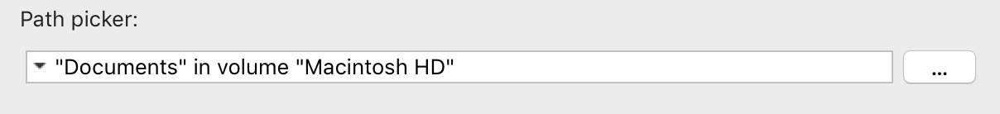

[](https://developer.4d.com/)
[](https://developer.4d.com/)


# What is it?

The `pathPicker` component is a widget for displaying and selecting the path of a target file or folder as you see it in various 4D application dialogs.



The main branch continues to evolve as 4D application evolves and now uses, among other things, <a href="https://developer.4d.com/docs/en/Concepts/classes.html">Classes</a> and <a href="https://developer.4d.com/docs/en/FormEditor/stylesheets.html">Style sheets</a> to allow an adaptation to the look & fill of your database.

The last version v18 compatible is available <a href="https://github.com/vdelachaux/pathPicker/releases/tag/v18">here</a>

# Initialization

```4d
$o:=New object
$o.placeHolder:="Select the backup setting file…"
$o.message:="Select a setting file…"
$o.fileTypes:=".4DSettings"
$o.directory:=1
$o.options:=Package open+Use sheet window
$picker:=pathPicker (File(Current backup settings file);$o)
```

# Properties

### Path properties

|Properties|Contents|
|----------|--------|
|**.target**|The target **File** or **Folder** (Object)|
|**.type**|The type of the target (Int)\*|
|**.platformPath**|The plateforme pathname (Text)|
|**.path**|The POSIX pathname (Text)|
\*4D constants _Is a document_ or _Is a folder_

### Widget behavior properties

|Properties|Contents|
|----------|--------|
|**.placeHolder**|The place holder displayed if the target is empty (Text)|
|**.message**|Title of the selection dialog box (Text)|
|**.directory**|Directory access path (text) or memorized access path (Int)\*|
|**.fileTypes**|List of types of documents to filter, or "*" to not filter documents(Text)\*|
|**.options**|Selection option(s) (Int)\*|
|**.browse**|Display the "Browse" button (Boolean)|
|**.showOnDisk**|Display the "Show on disk…" item in the linked menu (Boolean)|
|**.copyPath**|Display the "Copy path" item in the linked menu (Boolean)|
|**.openItem**|Allow the opening of a folder selected in the linked menu (Boolean)|
|**.label**|Label diplayed into the widget (Text)\*\*|
\*See the documentation for the commands **Select a document** and **Select a folder**.

\*\*The label is displayed in red if the path name is invalid. You shouldn't have to change it

### Default values

|Properties| |
|----------|--------|
|**.fileTypes**|_Is a document_|
|**.options**|_Package selection_ + _Use sheet window_|
|**.browse**|**True**|
|**.showOnDisk**|**True**|
|**.copyPath**|**True**|
|**.openItem**|**True**|

# Methods

### Changing the target

|Methods|Comments|
|-------|--------|
|**.setTarget**(Object)|Waiting for a **File** or **Folder**|
|**.setPlatformPath**(Text)||
|**.setPath**(Text)||

### Widget features

|Methods|Comments|
|-------|--------|
|**.setType**(Int)|Use the 4D constants _Is a document_ or _Is a folder_|
|**.setMessage**(Text)||
|**.setPlaceholder**(Text)||

# How to install

1. To use the widget as is, copy the <a href="https://github.com/vdelachaux/pathPicker/tree/master/Build/Components">pathPicker.4dbase</a> into the `Components` folder of your database.
2. If you want to integrate the component's elements into your code, you must copy the contents of the folders `Classes`, `Forms`, `Methods` & `Resources` to the corresponding folders of your database.
